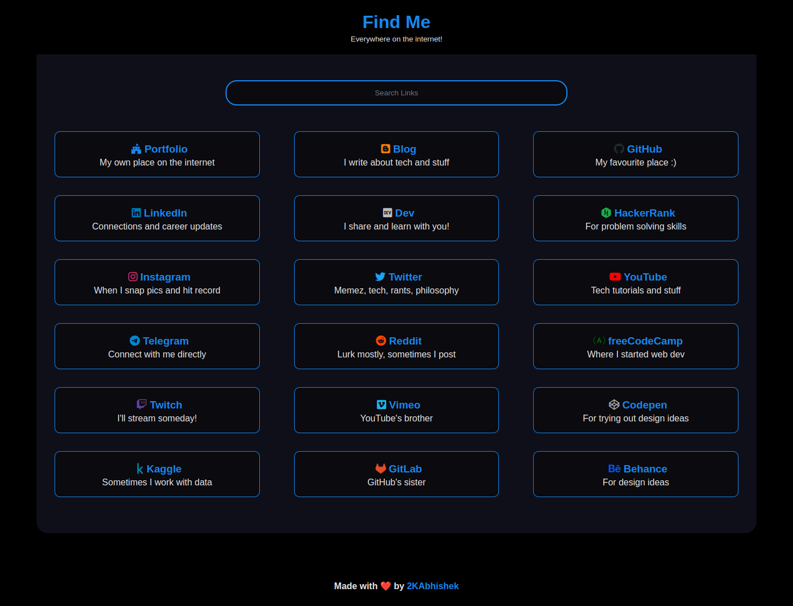

<div align = "center">

<h1><a href="https://2kabhishek.github.io/links">links</a></h1>

<a href="https://github.com/2KAbhishek/links/blob/main/LICENSE">
 </a>

<a href="https://github.com/2KAbhishek/links/graphs/contributors">
 </a>

<a href="https://github.com/2KAbhishek/links/stargazers">
</a>

<a href="https://github.com/2KAbhishek/links/network/members">
 </a>

<a href="https://github.com/2KAbhishek/links/watchers">
 </a>

<a href="https://github.com/2KAbhishek/links/pulse">
 </a>

<h3>Present your links in style 🔗🔮</h3>

<figure>
  
  <br/>
  <figcaption>links screenshot</figcaption>
</figure>

</div>

Have you ever wanted a place that can make all your profiles and links nicely organized, easily searchable and with super customizability?

Well, now you can!

## Introducing links

Present all your links in style with a easily accessible and highly customizable web app! ✨

## Inspiration

Needed a place to display all my profiles, used my [project's repo](https://2kabhishek.github.io/projects) as inspiration.

## Getting links

To get links, follow these steps:

```bash
git clone https://github.com/2kabhishek/links
cd links
```

## Setup Your Own links

You can easily set up links to show your own profiles.

-   Fork the repo
-   Clone it
-   Open up `script.js` and update the `username` variable to your internet username.
-   Edit the `links` JSON array in `script.js`, add/remove link elements as required.
-   Open up `index.html` and update the `title` tag to make it your username.
-   You may also want to update the favicon, update the `link` tag in `index.html`
-   Push your changes
-   Go to repo settings on GitHub and enable GitHub Pages.

The site should be live on `https://<your-username>.github.io/links`

### JSON Schema

Every link has the following properties:

-   `name`: The name of the link
-   `description`: The description of the link
-   `url`: The URL of the link
-   `icon`: The icon of the link, fontawesome classes in use
-   `color`: The color of the link, hex code in use

### Overriding URL Logic

If your username is different across sites or you want to add a custom url as a link just add the entire url in the `url` field.
Presence of `http` in the url string will override the URL building logic and present your link as is.

### Order Of Links

The order of links presented will be the same as their order in the `links` array in `scrip.js`.

### Brand Icons

This project uses [Font Awesome Brand](https://fontawesome.com/v6/icons?s=brands) for adding icons, if the icon you are looking for is not available, try using the full version of [Font Awesome](https://fontawesome.com/v6/icons/).

## Viewing links

Open `index.html` in your favorite browser or visit [2kabhishek.github.io/links](https://2kabhishek.github.io/links).

## How it was built

links was built using `HTML` `CSS` & `JavaScript`.
It was built on `neovim` and the node `live-server`.
Uses font awesome for icons.

## What I learned

-   Learned new use cases for `JSON Arrays`

## What's next

You tell me!

Hit the ⭐ button if you found this useful.

## More Info

<div align="center">

<a href="https://github.com/2KAbhishek/links">Source</a> | <a href="https://2kabhishek.github.io/links">Website</a>

</div>
